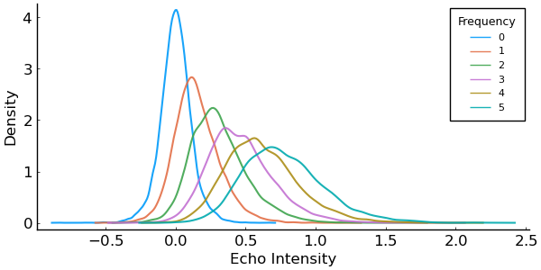

# GlobalMatchingModels

This package wil feature a variety of global matching models of recognition memory. Currently, the only model available is MINERVA 2. More to follow. 

## MINERVA


```julia
cd(@__DIR__)
using Pkg
Pkg.activate("..")
using GlobalMatchingModels, StatsPlots, Random
include("MINERVA_Functions.jl")
Random.seed!(356355)
```

```julia
# initialize model
model = MINERVA(h=.75, n_features=20, n_traces=60, L=.50)
# simulate experiment
sim_data = mapreduce(x->simulate(model, 4, 5), hcat, 1:10000)'
```

The plot replicates the results reported in Figure 4 of Hintzman (1988), showing that the echo intensity distributions increase in mean and variance as a function of frequency.

```julia
pyplot()
density(sim_data, alpha=.9, grid=false, norm=true, legendtitle="Frequency", label=[0:5;]',
    legendtitlefontsize=9, xaxis=font(12), yaxis=font(12), xlabel="Echo Intensity", ylabel="Density", 
    bins=50, size=(600,300))
```



*References*

1. Hintzman, D. L. (1988). Judgments of frequency and recognition model in a multiple-trace model model. 
    Psychological Review, 95(4), 528.
